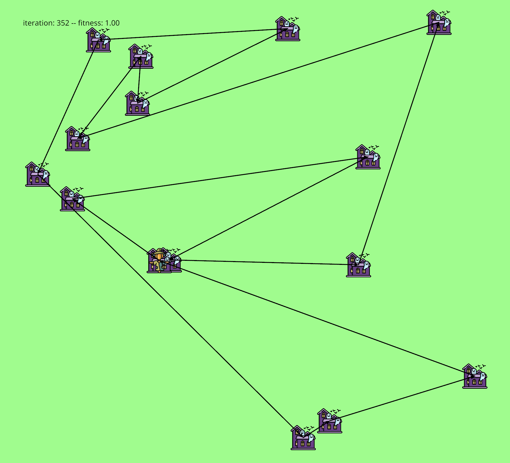

# Traveling Boogeyman

Welcome to the **Traveling Boogeyman** project. This project is a simulation that uses genetic algorithms to optimize paths in a virtual environment. It is built using Rust and the Nannou creative coding framework.


<p align="center">
  
</p>

## Table of Contents

- [Installation](#installation)
- [Usage](#usage)
- [Features](#features)
- [Contributing](#contributing)
- [License](#license)
- [Contact](#contact)

## Installation

To get started with the Boogeyman Pathfinding Simulation, ensure you have Rust installed on your system. Then, follow these steps:

1. Clone the repository:
   ```bash
   git clone https://github.com/elamribadrayour/traveling-boogeyman.git
   ```
2. Navigate to the project directory:
   ```bash
   cd traveling-boogeyman
   ```
3. Build the project:
   ```bash
   cargo build --release
   ```

## Usage

To run the simulation, use the following command:
```bash
cargo run --release
```

Once the simulation is running, a window will open displaying the paths, houses, and the boogeyman. The simulation will iterate through generations, optimizing the paths using genetic algorithms.

## Features

- **Genetic Algorithm Optimization**: Utilizes crossover and mutation to evolve paths.
- **Dynamic Visualization**: Real-time rendering of paths, houses, and the boogeyman using Nannou.
- **Configurable Parameters**: Adjust the number of paths, houses, and iterations to customize the simulation.

## License

This project is licensed under the MIT License. See the [LICENSE](LICENSE) file for more details.

## Contact

For any questions or feedback, feel free to reach out:

- GitHub: [elamribadrayour](https://github.com/elamribadrayour)
- Email: [badrayour.elamri@protonmail.com](mailto:badrayour.elamri@protonmail.com)
